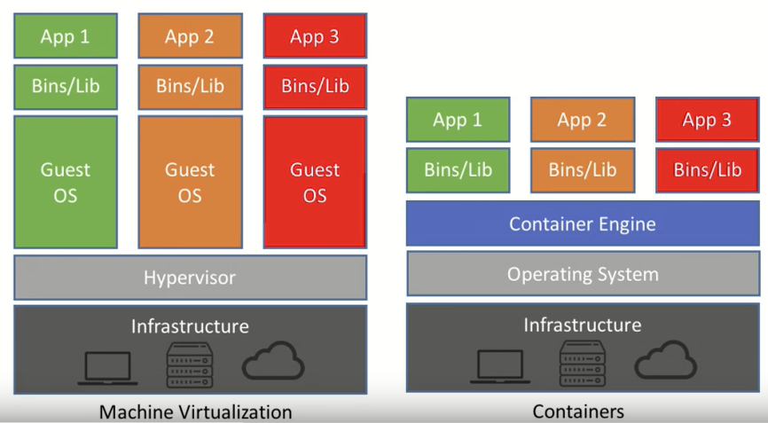

  

# Docker ou Machine virtuelle ?

  

  

  

## Commande Basique

  

lister les containers :

> **docker**  **ps**

  

Créer un container

> **docker**  **pull**  **$name:version$**

  

Lancer un container

> **docker run name**

> malgré le docker run , on n'appercevra pas le container il faudrait éxécuter un

> **docker ps -a (all)**

>pour lister **TOUT** les containers même ceux qui ont le status exit

  

>lorsque l'on run le container il se exécute sa tâche et s'éteint automatiquement

  

Pour pallier à cela, pour garder la main sur le container

>**docker run -di**

  

>-d : dettach

>-i : interactive

>--name préciser le nom du container

>